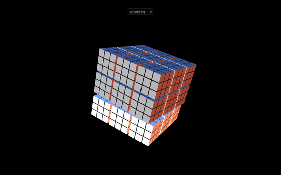
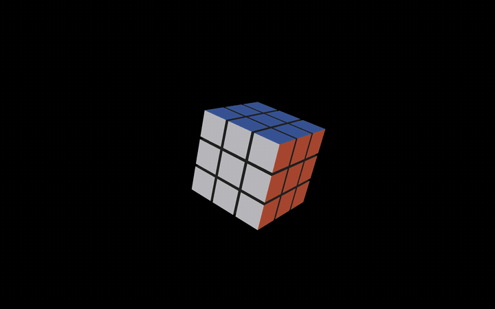

<div align="center">

# Rubik's Cube — OpenGL + Kociemba Solver

A C++ Rubik's Cube renderer in OpenGL with a built-in implementation of [Kociemba's two-phase algorithm](https://kociemba.org/cube.htm) for solving any scrambled state. Ships an in-app menu (ImGui) with two modes — a single 3×3×3 cube, or a 27-cube **HyperCube** that scrambles and reassembles itself.

[](https://github.com/RayverAimar/CG-rubiks-cube-solver/actions/workflows/ci.yml)
[](https://en.cppreference.com/w/cpp/17)
[](https://www.opengl.org/)
[](LICENSE)



</div>

---

## Modes

Pick a mode from the main menu (Tab anywhere returns to it).

### Rubik (3×3×3)

A single cube. F/B/U/D/L/R rotate faces, S scrambles, Space auto-solves with Kociemba.



### HyperCube (27 cubes)

A 3×3×3 cluster of 27 independent Rubik's cubes. Scramble runs the cluster-level rotations first, then scrambles each inner cube. Auto-solve plays the reverse as a 3-phase animation:

1. **Expand** — the 27 sub-cubes drift outward so each has room to animate.
2. **Solve in place** — every sub-cube runs its own Kociemba solve.
3. **Reassemble** — solved cubes slide back to their slot, then the cluster-level inverse moves run.

A "Solved!" banner with a brief scale pulse celebrates the end of every solve. The status banner reports what's active during the animation (`Scrambling – R`, `Auto-solving – U'`, …). The help overlay in the corner stays open until you toggle it with `H`.

## Build

The project pulls its window/input (GLFW 3.4), UI (Dear ImGui 1.91.5), and math (GLM 1.0.1) dependencies via CMake `FetchContent` — you don't need to install them manually.

**Requirements** (any one platform):

- CMake **≥ 3.24**
- A C++17 compiler — clang, gcc, or MSVC
- Git
- A working OpenGL 3.3 driver (any modern GPU)

**Same three commands on Linux, macOS, and Windows:**

```bash
git clone https://github.com/RayverAimar/CG-rubiks-cube-solver.git
cd CG-rubiks-cube-solver

cmake -B build -DCMAKE_BUILD_TYPE=Release
cmake --build build -j
```

The first configure takes ~1 minute (CMake clones GLFW, GLM, and ImGui from source). Subsequent builds are incremental.

### Run

```bash
# Linux / macOS
./build/rubik

# Windows
build\Release\rubik.exe
```

### Platform notes

**macOS** — install the Xcode Command Line Tools once (`xcode-select --install`); nothing else.

**Linux** — GLFW needs X11 / Wayland headers when building from source. On Debian / Ubuntu:

```bash
sudo apt install xorg-dev libxkbcommon-dev libwayland-dev wayland-protocols \
                 libxrandr-dev libxinerama-dev libxcursor-dev libxi-dev \
                 libgl1-mesa-dev
```

For headless environments (CI, servers) prefix the run with `xvfb-run`:

```bash
sudo apt install xvfb
xvfb-run -a ./build/rubik --screenshot-view rubik capture.ppm
```

**Windows** — Visual Studio 2022 (or Build Tools) provides the MSVC toolchain CMake picks up automatically. No extra system packages.

## Controls

| Key | Action |
|-----|--------|
| `F` `B` `U` `D` `L` `R` | Rotate face clockwise (Front / Back / Up / Down / Left / Right) |
| `Shift` + face key | Rotate face counter-clockwise |
| `S` | Scramble (random sequence) |
| `Space` | Auto-solve with Kociemba's algorithm |
| `Tab` | Return to the main menu |
| `H` | Toggle the help overlay |
| `↑ ↓ ← →` | Move the camera |
| Mouse | Look around |
| Mouse wheel | Zoom |
| `Esc` | Quit |

## Project layout

```
CG-rubiks-cube-solver/
├── main.cpp                    Entry point, ImGui menu + key/mouse callbacks
├── include/
│   ├── open_gl_loader.h        GLFW window + GL context bootstrap
│   ├── camera.h                FPS-style camera
│   ├── shader.h                GLSL program loader
│   ├── point.h, vector3d.h,
│   │   matrix4d.h, math_ops.h  Custom 3D math primitives
│   ├── square.h, cube.h,
│   │   rubik.h, hyper_cube.h   Cube geometry + animation
│   └── solver/                 Kociemba two-phase solver (C++ port)
│       ├── coordcube.cpp       Coordinate representation
│       ├── cubiecube.cpp       Cubie-level operations
│       ├── facecube.cpp        Sticker-level state
│       ├── prunetable_helpers  Pruning heuristics
│       └── search.cpp          IDA* search
├── shaders/                    GLSL vertex + fragment shaders
├── external/glad/              Vendored GLAD loader (GL 3.3 core)
├── scripts/record_gifs.sh      Capture scramble→solve GIFs (needs ffmpeg)
└── .github/workflows/ci.yml    Linux + macOS + Windows build matrix
```

## How it works

**Renderer.** Each of the 27 cubies is built from 6 `Square` instances batched into a single VAO. The `Rubik` class composes a 3×3×3 grid and animates face rotations via per-axis rotation matrices applied in the shader as `model · face_rotation · cubie_translation`. The HyperCube nests 27 of these.

**Solver.** When you press <kbd>Space</kbd>, the current cube state is encoded into the standard 54-character facelet string, fed into a C++ port of Herbert Kociemba's two-phase algorithm, and the resulting move sequence is replayed by the renderer at animation speed. In HyperCube mode each of the 27 sub-cubes runs an independent solve in parallel.

## Headless captures

The binary supports two flags for batch capture:

```bash
# Single warmed-up frame written as PPM. Views: menu | rubik | hyper.
./build/rubik --screenshot-view hyper capture.ppm

# Full scramble→solve cycle written as a sequence of PPM frames.
./build/rubik --record-view hyper /tmp/frames
```

The repository ships `scripts/record_gifs.sh` which wraps `--record-view` with `ffmpeg` to produce optimized GIFs (used to generate `docs/rubik.gif` and `docs/hyper.gif`):

```bash
brew install ffmpeg     # macOS
sudo apt install ffmpeg # Linux
./scripts/record_gifs.sh
```

The legacy `--screenshot <path>` is kept for the CI smoke test (defaults to the HyperCube view).

## License

[MIT](LICENSE)
