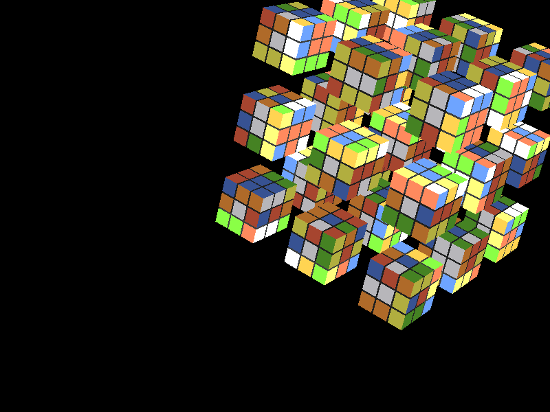

<div align="center">

# Rubik's Cube — OpenGL + Kociemba Solver

A C++ Rubik's Cube renderer in OpenGL with a built-in implementation of [Kociemba's two-phase algorithm](https://kociemba.org/cube.htm) for solving any scrambled state.

[](https://github.com/RayverAimar/CG-rubiks-cube-solver/actions/workflows/ci.yml)
[](https://en.cppreference.com/w/cpp/17)
[](https://www.opengl.org/)
[](LICENSE)



</div>

---

## Build

The project pulls its window/input (GLFW) and math (GLM) dependencies via CMake `FetchContent` — you don't need to install them manually.

**Requirements** (any one platform):

- CMake **≥ 3.24**
- A C++17 compiler — clang, gcc, or MSVC
- Git
- A working OpenGL 3.3 driver (any modern GPU)

**Same three commands on Linux, macOS, and Windows:**

```bash
git clone https://github.com/RayverAimar/CG-rubiks-cube-solver.git
cd CG-rubiks-cube-solver

cmake -B build -DCMAKE_BUILD_TYPE=Release
cmake --build build -j
```

The first configure takes ~1 minute (CMake clones GLFW 3.4 and GLM 1.0.1 from source). Subsequent builds are incremental.

### Run

```bash
# Linux / macOS
./build/rubik

# Windows
build\Release\rubik.exe
```

### Linux — extra system packages

GLFW needs X11 / Wayland headers when building from source:

```bash
sudo apt install xorg-dev libxkbcommon-dev libwayland-dev wayland-protocols
```

For headless environments (CI, servers) prefix the run with `xvfb-run`:

```bash
xvfb-run -a ./build/rubik --screenshot capture.ppm
```

## Controls

| Key | Action |
|-----|--------|
| `F` `B` `U` `D` `L` `R` | Append a face turn (Front / Back / Up / Down / Left / Right) |
| `Caps Lock` | Toggle prime mode — same keys produce counter-clockwise turns |
| `Enter` | Apply the queued turn sequence to the cube |
| `Space` | Auto-solve the current state with Kociemba's algorithm |
| `↑ ↓ ← →` | Move the camera |
| Mouse | Look around |
| Mouse wheel | Zoom |
| `Esc` | Quit |

## Project layout

```
CG-rubiks-cube-solver/
├── main.cpp                    Entry point + key / mouse callbacks
├── include/
│   ├── open_gl_loader.h        GLFW window + GL context bootstrap
│   ├── camera.h                FPS-style camera
│   ├── shader.h                GLSL program loader
│   ├── point.h, vector3d.h,
│   │   matrix4d.h, math_ops.h  Custom 3D math primitives
│   ├── square.h, cube.h,
│   │   rubik.h, hyper_cube.h   Cube geometry + animation
│   └── solver/                 Kociemba two-phase solver (C++ port)
│       ├── coordcube.cpp       Coordinate representation
│       ├── cubiecube.cpp       Cubie-level operations
│       ├── facecube.cpp        Sticker-level state
│       ├── prunetable_helpers  Pruning heuristics
│       └── search.cpp          IDA* search
├── shaders/                    GLSL vertex + fragment shaders
├── external/glad/              Vendored GLAD loader (GL 3.3 core)
└── .github/workflows/ci.yml    Linux + macOS + Windows build matrix
```

## How it works

**Renderer.** Each of the 27 cubies is built from 6 `Square` instances batched into a single VAO. The `HyperCube` class composes a 3×3×3 grid and animates face rotations via per-axis rotation matrices applied in the shader as `model · face_rotation · cubie_translation`.

**Solver.** When you press <kbd>Space</kbd>, the current cube state is encoded into the standard 54-character facelet string, fed into a C++ port of Herbert Kociemba's two-phase algorithm, and the resulting move sequence is replayed by the renderer at animation speed.

## Headless screenshot

A `--screenshot <path>` flag renders one warmed-up frame and dumps the framebuffer as a PPM:

```bash
./build/rubik --screenshot capture.ppm
sips -s format png capture.ppm --out capture.png   # macOS
convert capture.ppm capture.png                    # Linux (ImageMagick)
```

CI uses this to smoke-test that the build actually opens a GL context and renders.

## License

[MIT](LICENSE)
